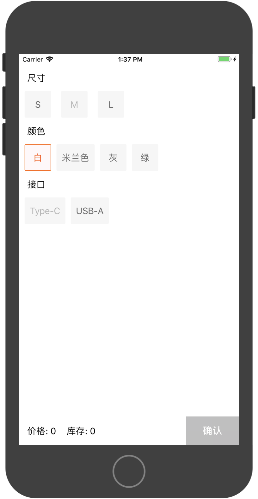
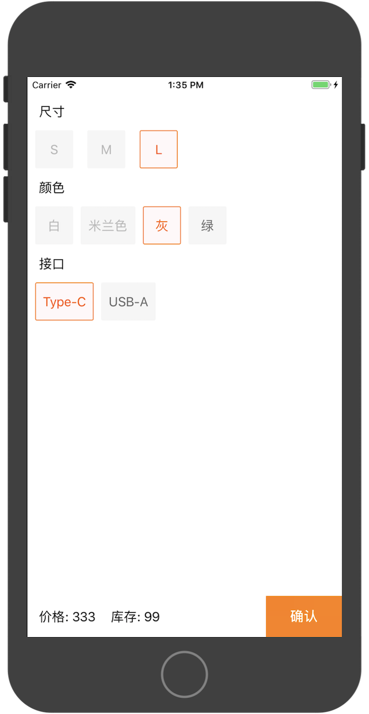

# SKUFilterDemo - 电商Stock Keeping Unit选择过滤器示例

## 截图

## 简介

使用Swift实现了SKU数据过滤器, 用于电商类APP 商品属性选择等场景.

代码在Swift语法特性方面得到了充分优化, 并非"逐行翻译".

个人觉得逻辑上有一定优化空间, 还在不断探索中.

实现参考自: __[iOS-SKU商品规格组合算法详解](https://www.jianshu.com/p/295737e2ac77)__, __[Objective-C 原版本](https://github.com/SunriseOYR/SKUDataFilter)__.
